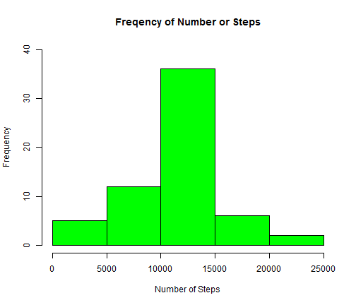

# Reproducible Research: Peer Assessment 1
========================================================

## Loading and preprocessing the data


```r
activity <- read.csv("~/activity.csv")
install.packages("reshape2")
```

```
## Installing package into 'C:/Users/Helena/Documents/R/win-library/3.0'
## (as 'lib' is unspecified)
```

```
## Error: trying to use CRAN without setting a mirror
```

```r
library(reshape2)
```

```
## Warning: package 'reshape2' was built under R version 3.0.3
```


## What is mean total number of steps taken per day?

This part will ignore the missing values in the dataset


```r
molten = melt(activity, id = c("date", "interval"))
step_sum <- dcast(molten, formula = date ~ variable, sum)
```


Make a histogram of the total number of steps taken each day


```r
hist(x <- step_sum$steps, col = "red", ylim = c(0, 30), xlab = "Number of Steps", 
    main = "Freqency of Number or Steps")
```

 


Calculate and report the mean and median total number of steps taken per day

The mean: 

```r
mean(step_sum$steps, na.rm = TRUE)
```

```
## [1] 10766
```


The median: 

```r
median(step_sum$steps, na.rm = TRUE)
```

```
## [1] 10765
```


## What is the average daily activity pattern?
Make a time series plot (i.e. type = "l") of the 5-minute interval (x-axis) and the average number of steps taken, averaged across all days (y-axis)


```r
molten2 = melt(activity, id = c("interval", "date"), na.rm = TRUE)
step_avg <- dcast(molten2, interval ~ variable, mean, drop = TRUE)
```


```r
plot(x <- step_avg$interval, y <- step_avg$steps, type = "l", ylim = c(0, 220), 
    col = "blue", xlab = "Interval", ylab = "Average Number of Steps", main = "Average Number or Steps per Interval")
```

 


Which 5-minute interval, on average across all the days in the dataset, contains the maximum number of steps?


```r
step_avg$interval[which.max(step_avg$steps)]
```

```
## [1] 835
```


## Imputing missing values

Calculate and report the total number of missing values in the dataset (i.e. the total number of rows with NAs)


```r
sum(is.na(activity$steps))
```

```
## [1] 2304
```


Using the mean for 5-minute interval as the strategy for filling in all of the missing values

Create a new dataset that is equal to the original dataset but with the missing data filled in.


```r
new_act <- activity
search_interval <- new_act[which(is.na(new_act$steps)), 3]  #find the interval of mising values (Steps)
new_act[which(is.na(new_act$steps)), 1] <- step_avg[(match(search_interval, 
    step_avg$interval)), 2]
```


Make a histogram of the total number of steps taken each day 


```r
molten3 = melt(new_act, id = c("date", "interval"))
step_sum_new <- dcast(molten3, formula = date ~ variable, sum)
```


```r
hist(x <- step_sum_new$steps, col = "green", ylim = c(0, 40), xlab = "Number of Steps", 
    main = "Freqency of Number or Steps")
```

 


Calculate and report the mean and median total number of steps taken per day. 

The mean: 

```r
mean(step_sum_new$steps, na.rm = TRUE)
```

```
## [1] 10766
```


The median: 

```r
median(step_sum_new$steps, na.rm = TRUE)
```

```
## [1] 10766
```


Do these values differ from the estimates from the first part of the assignment? What is the impact of imputing missing data on the estimates of the total daily number of steps?

The mean is the same for both parts.  But the median is a bit larger after imputing missing data and now it equals to the corresponding mean.


## Are there differences in activity patterns between weekdays and weekends?

Create a new factor variable in the dataset with two levels - "weekday" and "weekend" indicating whether a given date is a weekday or weekend day.


```r
new_act$date <- weekdays(as.Date(as.character(new_act$date), "%Y-%m-%d"))

for (i in 1:length(new_act$date)) {
    if (new_act$date[i] == "Saturday" | new_act$date[i] == "Sunday") {
        new_act$date[i] <- "weekend"
    } else {
        new_act$date[i] <- "weekday"
    }
}
new_act$date <- factor(new_act$date)
```


Make a panel plot containing a time series plot (i.e. type = "l") of the 5-minute interval (x-axis) and the average number of steps taken, averaged across all weekday days or weekend days (y-axis). 


```r
molten4 = melt(new_act, id = c("interval", "date"))
new_step_avg = dcast(molten4, interval + date ~ variable, mean)

library(lattice)
```

```
## Warning: package 'lattice' was built under R version 3.0.3
```

```r
xyplot(new_step_avg$steps ~ new_step_avg$interval | date, data = new_step_avg, 
    layout = c(1, 2), type = "l", ylab = "Number of steps", xlab = "Interval")
```

 


It is shown in the panel plot that the average number of steps taken are different,averaged across all weekday days and weekend days
